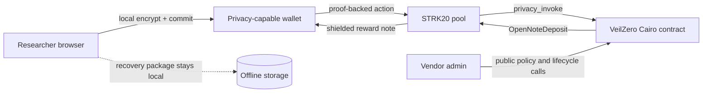

# VeilZero

Private coordinated vulnerability disclosure with encrypted reports, proof-of-authorship, committed remediation timelines, and shielded STRK20 bounty settlement.

> Status: browser encryption, read-only Wallet API diagnostics, Cairo protocol, and a public GitHub Pages demo are implemented. Mainnet contracts, transactions, and video are not yet claimed. Empty evidence fields are intentional.

## The problem

A researcher reporting a critical vulnerability must often reveal identity and wallet history before a vendor has earned that trust. Email leaks metadata; conventional platforms become identity honeypots; transparent bounty transfers permanently connect a person, a protocol, and a reward.

Privacy is necessary for the report, case identity, unrelated cases, and payout recipient linkage. Accountability is necessary for the vendor policy, acknowledgement clock, remediation clock, lifecycle state, bounty reserve, and one-time settlement.

## What works now

| Capability | State | Evidence |
|---|---|---|
| Vendor-readable X25519/HKDF/AES-GCM envelope encryption | Implemented + unit/browser tested | Keys and plaintext remain in-browser |
| Shareable encrypted case envelope | Implemented + unit/browser tested | Public JSON excludes secrets; its ciphertext commitment is verified before decryption |
| Domain-separated case/report commitments | Implemented + unit tested | `VEILZERO_V1` domains |
| Recovery-package export | Implemented | Read-only browser demo |
| Selective authorship proof | Implemented + unit tested | Case-scoped Stark signature; no recovery secrets exported |
| Wallet discovery/capability probe | Implemented + unit tested | Chain/API/STRK20 balance capability; no write |
| Program, case, clarification and fixed-tier lifecycle | Implemented + deployed-contract tested | `contracts/src/lib.cairo` |
| Pool-pinned `privacy_invoke` | Implemented against starter ABI | Configured pool is caller, never the user |
| Reserve-backed open-note settlement | Implemented, not deployed | One-time nullifier + expiry |
| Destination-bound claim preparation | Implemented + unit/contract tested; live unverified | Estimation-only preview, marker extraction, case signature, proof completeness and note-drift abort |
| Wallet API submission | Deferred pending live ABI validation | Diagnostic is explicitly read-only; no fake success path |
| Mainnet evidence | Not started | `strk20.json` is honestly empty |

## Three-minute demo flow

1. Open the privacy boundary and program policy.
2. Enter a report; observe that encryption happens locally and plaintext disappears.
3. Export the case recovery receipt.
4. Show the Cairo state machine: submit, acknowledge, accept, authorize, settle.
5. Once deployed, execute submission, follow-up and settlement through STRK20.
6. Verify pool and VeilZero involvement from transaction receipts.

## Architecture



The vendor funds a bounded fixed-tier reserve. A researcher sends the encrypted envelope out of band and submits its commitments, size, and a case-scoped Stark public key through the pool; ciphertext is not stored on Starknet. The vendor's public account acknowledges and decides. Acceptance stores a commitment to a one-time claim secret, tier and expiry—not the secret itself. A claim reveals that secret and a case-key signature bound to its destination note, preventing payout redirection even if calldata is copied. Successful settlement marks the nullifier used, debits reserve accounting, approves exactly the fixed tier, and returns one `OpenNoteDeposit` to the pool.

## STRK20 integration depth

VeilZero is a stateful anonymizer rather than a private-transfer skin. Its contract pins the pool as the only `privacy_invoke` caller, stores project-specific state, returns the current `OpenNoteDeposit` ABI, and enforces project state before the pool can create the reward note. The mainnet route is blocked until the live pool/anonymizer boundary is verified; upstream issue #978 shows current `main` differs from the deployed Sepolia return ABI.

The destination-bound claim preparation and its fail-closed invariants are documented in [docs/WALLET_CLAIM_ADAPTER.md](docs/WALLET_CLAIM_ADAPTER.md).

## Mainnet addresses and verified transactions

No contract address or transaction hash is claimed yet.

| Action | VeilZero contract | STRK20 pool | Transaction | Status |
|---|---|---|---|---|
| Case submission | — | — | — | Not executed |
| Case follow-up | — | — | — | Not executed |
| Bounty settlement | — | — | — | Not executed |

## Privacy boundary

| Intended hidden | Public | Potentially correlatable |
|---|---|---|
| Report/follow-up plaintext; local case secret; authorship witness; unrelated cases; shielded recipient linkage where provided by STRK20 | Program/policy; contract addresses; action existence and timing; deadlines/status; one-time claim secret and signature after settlement; shield deposit address, token and amount; amount if execution exposes it | Timing; fixed or unusual amounts; ciphertext size; IP/browser/network metadata; wallet behavior; deposit-to-action timing; low anonymity sets |

VeilZero does **not** claim absolute anonymity, hidden deposits, hidden timing, hidden network metadata, audit status, production safety, or regulatory compliance.

## Threat model summary

The contract defends against duplicate settlement, cross-program replay, reward-tier substitution, expired authorization, nullifier reuse, forged clarification, destination-note substitution, unauthorized lifecycle transitions, empty/oversized payloads, and treating the privacy pool caller as an authenticated end user. Remaining risks include calldata/metadata correlation, unaudited code, wallet/prover/discovery trust, sequencer ordering, vendor key compromise and recovery-package loss. See [docs/THREAT_MODEL.md](docs/THREAT_MODEL.md).

## Local setup

Requires Node 24+ and pnpm 11.24.0.

```bash
pnpm install --frozen-lockfile
pnpm dev
```

Checks:

```bash
pnpm lint
pnpm typecheck
pnpm test
pnpm build
pnpm test:e2e
pnpm scan:secrets
cd contracts && scarb build
# Linux/WSL with Starknet Foundry 0.63.0:
scarb test
```

## Current limitations

- X25519 envelope encryption requires modern WebCrypto support; the no-program-key path remains a conspicuously local-only diagnostic fallback.
- No hosted prover or discovery endpoint is configured or trusted.
- The destination-bound Wallet API claim adapter is implemented but not live-validated. It uses a non-submittable estimation preview to resolve `${openNoteIds[0]}`, signs that note, prepares the real proof, and aborts on note drift. A compatible wallet and deployed pool must verify the full behavior before enabling submission.
- No contract is deployed; no mainnet transaction or fee exists.
- Ciphertext delivery is an out-of-band public-envelope file in this MVP. Availability and transport confidentiality are not provided by VeilZero.
- Vendor lifecycle calls are public by design in the MVP.
- The code is unaudited and unsuitable for material funds.

## OSS reuse surface

The Cairo reserve/settlement anonymizer, explicit privacy-boundary model, evidence verifier, domain-separated case package, and deadline-bound disclosure state machine are intended as reusable components for security programs.

## Roadmap

1. Validate the exact live mainnet ABI and pool fee.
2. Validate Wallet API transaction building against the deployed pool ABI.
3. Run Cairo and browser adversarial suites; deploy to a supported test path.
4. Deploy through a human wallet gate, verify three mainnet transactions, publish demo and video.

## License and attribution

Apache-2.0. Architecture references the MIT-licensed STRK20 starter kit at commit `187fe789dd4f5de14ccb0953abfdb49a26643664` and the Apache-2.0 Starknet Privacy monorepo at commit `4db755b9512f00b540126737b605472ea2275e15`; no upstream Git history is presented as VeilZero history.
