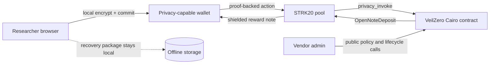

# VeilZero

Private coordinated vulnerability disclosure with encrypted reports, proof-of-authorship, committed remediation timelines, and shielded STRK20 bounty settlement.

> Status: browser encryption, read-only Wallet API diagnostics, Cairo protocol, and a public GitHub Pages demo are implemented. Mainnet contracts, transactions, and video are not yet claimed. Empty evidence fields are intentional.

## The problem

A researcher reporting a critical vulnerability must often reveal identity and wallet history before a vendor has earned that trust. Email leaks metadata; conventional platforms become identity honeypots; transparent bounty transfers permanently connect a person, a protocol, and a reward.

Privacy is necessary for the report, case identity, unrelated cases, and payout recipient linkage. Accountability is necessary for the vendor policy, acknowledgement clock, remediation clock, lifecycle state, bounty reserve, and one-time settlement.

## What works now

| Capability | State | Evidence |
|---|---|---|
| Vendor-readable X25519/HKDF/AES-GCM envelope encryption | Implemented + unit/browser tested | Keys and plaintext remain in-browser |
| Public vendor program manifest | Implemented + unit/browser tested | Binds encryption key, policy, SLAs, token and fixed tiers; contains no private key |
| Shareable encrypted case envelope | Implemented + unit/browser tested | Public JSON excludes secrets; its ciphertext commitment is verified before decryption |
| Domain-separated case/report commitments | Implemented + unit tested | `VEILZERO_V1` domains |
| Recovery-package export | Implemented | Read-only browser demo |
| Selective authorship proof and local verifier | Implemented + unit/browser tested | Strict bounded import, case-scoped Stark signature; no recovery secrets exported |
| Wallet discovery/capability probe | Implemented + unit tested | Chain/API/STRK20 balance capability; no write |
| Private case submission and clarification preparation | Implemented + unit tested; live unverified | Exact 11-field action mapping, case-key signature and incomplete-proof rejection |
| Case-signed reward authorization request | Implemented + unit/browser/contract tested | Secret-free artifact; vendor substitution and cross-program replay fail on-chain |
| Vendor program, reserve and lifecycle calls | Implemented + unit/browser tested; live unverified | Exact funding approval, verified request signature, case locks, paused available-reserve withdrawal, fixed entrypoints |
| Reload-safe transaction reconciliation | Implemented + unit tested | Stores only public pending metadata; mismatches/timeouts remain ambiguous and block retry |
| Shield/self-transfer/unshield diagnostic construction | Implemented + unit/browser tested; submission disabled | Connected-account-bound UI previews exact fixed-value actions; `OPEN` is excluded |
| Program, case, clarification and fixed-tier lifecycle | Implemented + deployed-contract tested | `contracts/src/lib.cairo` |
| Pool-pinned `privacy_invoke` | Implemented + contract tested + live ABI probed | Single-span return matches official docs and observed mainnet pool v2.0 |
| Case-locked reserve and open-note settlement | Implemented + deployed-contract tested, not deployed | Authorization locks funds; expiry release; one-time nullifier |
| Destination-bound claim preparation | Implemented + unit/contract tested; live unverified | Pool-pinned estimation preview, marker extraction, case signature, empty-preview/proof checks and note-drift abort |
| Reproducible contract artifact identity | Verified locally, not declared | Pinned Sierra/CASM SHA-256 and class hashes in `docs/evidence/contract-artifact.md` |
| Deterministic deployment handoff | Read-only mainnet verified | Artifact/pool/UDC/declaration checks; unique address derived from a public deployer address |
| Live pool diagnostics | Read-only mainnet verified | Address, class, ABI surface, version and 6 STRK observed fee pinned to block `14205166` |
| Wallet API submission | Deferred pending live wallet validation | Diagnostic is explicitly read-only; no fake success path |
| Mainnet evidence | Not started | `strk20.json` is honestly empty |

## Three-minute demo flow

1. Open the privacy boundary and program policy.
2. Enter a report; observe that encryption happens locally and plaintext disappears.
3. Export the case recovery receipt.
4. Export and verify the case-signed reward request; preview acknowledge, accept/reject, and authorization calls without signing.
5. Once deployed, execute submission, follow-up and settlement through STRK20.
6. Verify pool and VeilZero involvement from transaction receipts.

## Architecture



The vendor funds a bounded fixed-tier reserve. A researcher sends the encrypted envelope out of band and submits its commitments, size, and a case-scoped Stark public key through the pool; ciphertext is not stored on Starknet. The vendor's public account acknowledges and decides. The researcher exports a secret-free, case-signed reward request; Cairo verifies that signature before authorization can store the one-time claim-secret commitment, lock the fixed tier, and record expiry—not the secret itself. The administrator can release the lock only after expiry. A claim reveals the secret and a case-key signature bound to its destination note, preventing payout redirection even if calldata is copied. Successful settlement marks the nullifier used, spends the case lock, approves exactly that amount, and returns one `OpenNoteDeposit` to the pool.

## STRK20 integration depth

VeilZero is a stateful anonymizer rather than a private-transfer skin. Its contract pins the pool as the only `privacy_invoke` caller, stores project-specific state, returns one `Span<OpenNoteDeposit>`, and enforces project state before the pool can create the reward note. The official helper documentation and a block-pinned read of the live mainnet pool v2.0 agree on that legacy surface. Upstream issue #978 remains an upgrade warning: current privacy-monorepo `main` has moved to a newer return shape, so VeilZero re-probes the upgradeable pool rather than assuming compatibility.

Researcher submission/clarification preparation is documented in [docs/WALLET_CASE_ADAPTER.md](docs/WALLET_CASE_ADAPTER.md), and vendor public calls in [docs/WALLET_ADMIN_ADAPTER.md](docs/WALLET_ADMIN_ADAPTER.md). The destination-bound claim preparation and its fail-closed invariants are documented in [docs/WALLET_CLAIM_ADAPTER.md](docs/WALLET_CLAIM_ADAPTER.md).
The selective, case-signed handoff into vendor authorization is documented in [docs/REWARD_AUTHORIZATION_REQUEST.md](docs/REWARD_AUTHORIZATION_REQUEST.md).

## Mainnet addresses and verified transactions

No contract address or transaction hash is claimed yet.

| Action | VeilZero contract | STRK20 pool | Transaction | Status |
|---|---|---|---|---|
| Case submission | — | `0x040337b1af3c663e86e333bab5a4b28da8d4652a15a69beee2b677776ffe812a` | — | Not executed |
| Case follow-up | — | `0x040337b1af3c663e86e333bab5a4b28da8d4652a15a69beee2b677776ffe812a` | — | Not executed |
| Bounty settlement | — | `0x040337b1af3c663e86e333bab5a4b28da8d4652a15a69beee2b677776ffe812a` | — | Not executed |

## Privacy boundary

| Intended hidden | Public | Potentially correlatable |
|---|---|---|
| Report/follow-up plaintext; local case secret; authorship witness; unrelated cases; shielded recipient linkage where provided by STRK20 | Program/policy; contract addresses; action existence and timing; deadlines/status; one-time claim secret and signature after settlement; shield deposit address, token and amount; amount if execution exposes it | Timing; fixed or unusual amounts; ciphertext size; IP/browser/network metadata; wallet behavior; deposit-to-action timing; low anonymity sets |

VeilZero does **not** claim absolute anonymity, hidden deposits, hidden timing, hidden network metadata, audit status, production safety, or regulatory compliance.

## Threat model summary

The contract defends against duplicate settlement, cross-program replay, vendor claim-commitment substitution, reward-tier substitution, expired authorization, nullifier reuse, forged clarification, destination-note substitution, unauthorized lifecycle transitions, empty/oversized payloads, and treating the privacy pool caller as an authenticated end user. Remaining risks include calldata/metadata correlation, unaudited code, wallet/prover/discovery trust, sequencer ordering, vendor key compromise and recovery-package loss. See [docs/THREAT_MODEL.md](docs/THREAT_MODEL.md).

## Local setup

Requires Node 24+ and pnpm 11.24.0.

```bash
pnpm install --frozen-lockfile
pnpm dev
```

Checks:

```bash
pnpm lint
pnpm typecheck
pnpm test
pnpm build
pnpm test:e2e
pnpm scan:secrets
pnpm prepare:deployment # requires current RPC, pool and public deployer address
cd contracts && scarb build
cd .. && pnpm verify:artifact
# Linux/WSL with Starknet Foundry 0.63.0:
cd contracts && scarb test
```

## Current limitations

- X25519 envelope encryption requires modern WebCrypto support; the no-program-key path remains a conspicuously local-only diagnostic fallback.
- No application prover or discovery endpoint is configured: the official dapp route assigns keys, note discovery and proving to the connected privacy wallet. The wallet's infrastructure remains a trust and availability boundary.
- The destination-bound Wallet API claim adapter is implemented but not live-validated. It uses a non-submittable estimation preview to resolve `${openNoteIds[0]}`, signs that note, prepares the real proof, and aborts on wrong-pool output, unexpected preview proof material, note drift, or incomplete proof. The browser exposes a prepare-only harness that rechecks mainnet/account/API and discards the proof without submitting; a compatible live wallet, deployed helper, and authorized case must still run it before enabling claim submission.
- No contract is deployed; no mainnet transaction or fee exists.
- Ciphertext delivery is an out-of-band public-envelope file in this MVP. Availability and transport confidentiality are not provided by VeilZero.
- Vendor lifecycle calls are public by design in the MVP.
- The code is unaudited and unsuitable for material funds.

## OSS reuse surface

The Cairo reserve/settlement anonymizer, signed reward-request artifact, explicit privacy-boundary model, evidence verifier, domain-separated case package, and deadline-bound disclosure state machine are intended as reusable components for security programs.

## Roadmap

1. Re-probe the upgradeable live mainnet pool and fee immediately before each signing gate.
2. Generate the address-specific deployment plan and deploy the helper through the human browser-wallet gate.
3. Create and authorize a real case, then run the prepare-only validation harness with a compatible wallet before enabling claim submission.
4. Verify three mainnet transactions, then publish the demo video and final evidence.

## License and attribution

Apache-2.0. Architecture references the MIT-licensed STRK20 starter kit at commit `187fe789dd4f5de14ccb0953abfdb49a26643664` and the Apache-2.0 Starknet Privacy monorepo at commit `4db755b9512f00b540126737b605472ea2275e15`; no upstream Git history is presented as VeilZero history.
