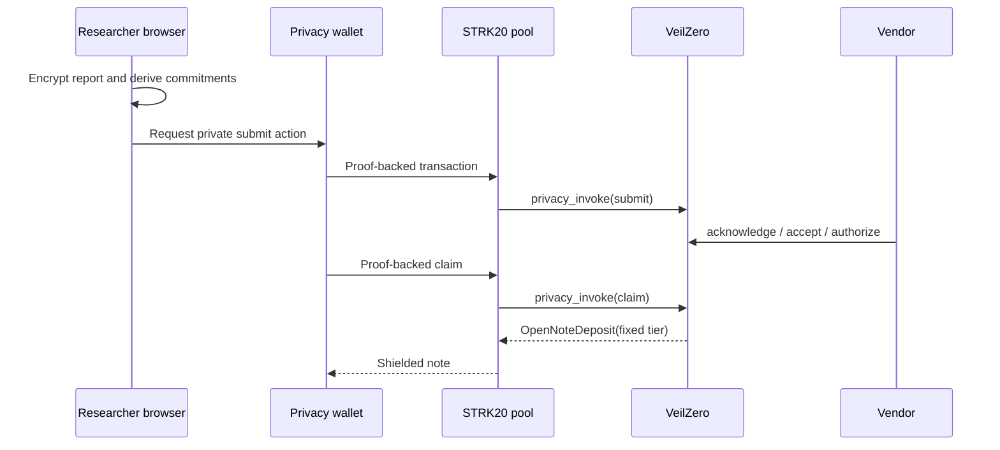

# Architecture

The browser owns report plaintext, vendor X25519 private key, random case secret, case-scoped Stark signing key and recovery package. A researcher derives an envelope key from an ephemeral X25519 key and the program public key, then builds domain-separated commitments before any network operation. A separate shareable JSON envelope contains ciphertext and public verification material but no recovery secrets. Its transport is out of band. A Ready-compatible wallet is intended to prove and submit STRK20 actions. The live pool calls the pool-pinned VeilZero anonymizer. The vendor uses a public administrator account for policy and lifecycle actions.

No database or key-holding backend is used. Reward authorization moves the fixed tier from available program reserve into a case-scoped lock, preventing one balance from backing multiple promises; settlement consumes that lock, while only an expired lock can be returned for reauthorization. Under the current official Wallet API route, the connected privacy wallet owns note discovery and proving; VeilZero neither configures a hosted prover/discovery endpoint nor receives those secrets. The claim adapter uses Wallet API 0.10.3 twice: a non-submittable estimation call resolves a marker-delimited open-note ID, the browser case key signs it, and a proof-producing preparation must resolve the identical ID. Empty proofs and drift abort before submission. Local client and contract tests pass; a live compatible wallet must still prove this behavior before submission is enabled.
