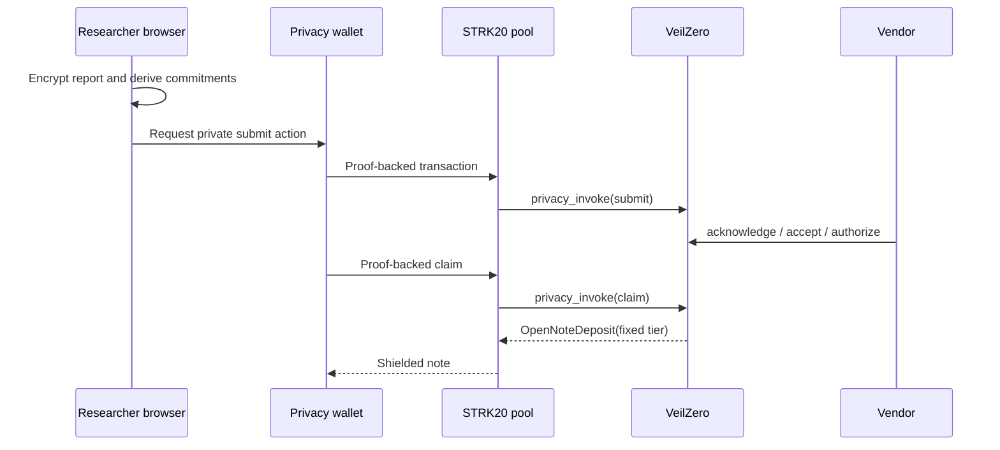

# Architecture

The browser owns report plaintext, random case secret and recovery package. It builds domain-separated commitments and ciphertext before any network operation. A Ready-compatible wallet is intended to prove and submit STRK20 actions. The live pool calls the pool-pinned VeilZero anonymizer. The vendor uses a public administrator account for policy and lifecycle actions.

No database or key-holding backend is used. Hosted proving/discovery remain unconfigured until an official endpoint and its visibility are verified.
