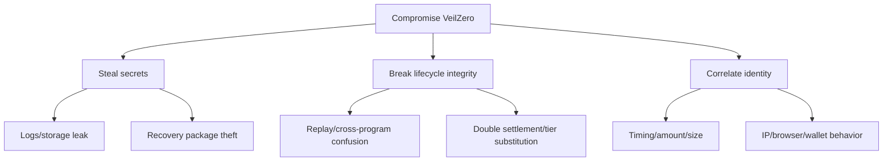

# Threat model

Assets: report plaintext, case secret, recovery package, payout linkage, program reserve and lifecycle integrity. Adversaries include observers, malicious researchers/vendors, compromised frontend dependencies, hostile metadata services and transaction frontrunners.

Controls: WebCrypto randomness, ephemeral X25519/HKDF envelope keys, AES-GCM nonce uniqueness and authenticated context, Stark signatures for case follow-ups and claim destinations, domain-separated Poseidon commitments, input bounds, program+case keying, pool pinning, ordered fixed tiers, case-scoped reserve locks at authorization, administrator release only after expiry, one-time nullifiers, terminal states, and honest failed/unknown UI states.

Open risks: unaudited Cairo/TypeScript, vendor or recovery-key compromise, connected-wallet prover/discovery trust and availability, no VeilZero deployment, pool upgrades after a compatibility probe, out-of-band ciphertext availability and transport metadata, browser compromise, public claim calldata after execution, and metadata correlation. Copying a valid claim cannot redirect its destination because the destination note is signed; it can still race the original and create an ambiguous receipt that must be reconciled. The local Wallet API 0.10.3 adapter fails closed on note drift and incomplete proofs, but marker visibility and note stability remain deployment-blocking until validated with a live compatible wallet.
