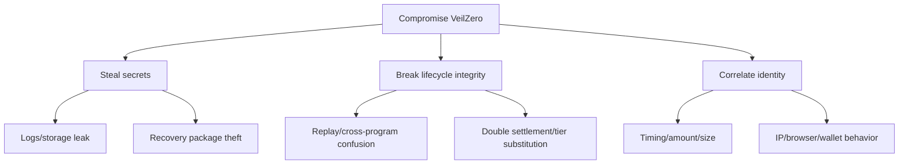

# Threat model

Assets: report plaintext, case secret, recovery package, payout linkage, program reserve and lifecycle integrity. Adversaries include observers, malicious researchers/vendors, compromised frontend dependencies, hostile metadata services and transaction frontrunners.

Controls: WebCrypto randomness, AES-GCM nonce uniqueness, domain separation, input bounds, program+case keying, pool pinning, ordered fixed tiers, reserve checks, authorization expiry, one-time nullifiers, terminal states, and honest failed/unknown UI states.

Open risks: unaudited Cairo/TypeScript, diagnostic symmetric key not vendor envelope encryption, no verified live prover/discovery endpoint, no deployed ABI validation, ciphertext availability design, browser compromise and metadata correlation.
