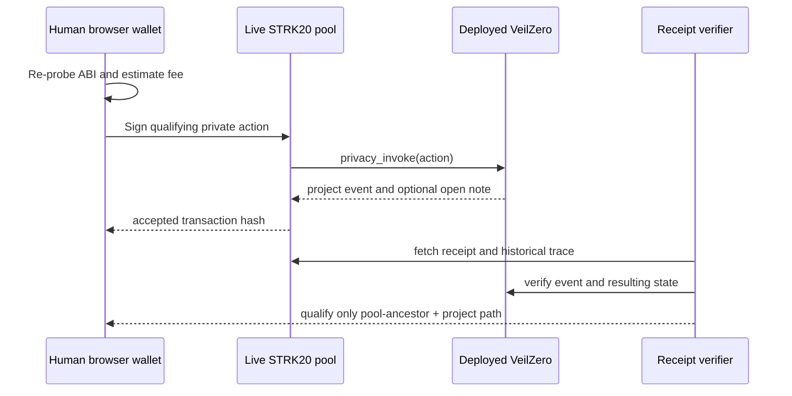

# Mainnet evidence plan

| # | Action | Entrypoint | Expected state/event | Privacy and leakage | Qualification |
|---|---|---|---|---|---|
| 1 | Submit bounded encrypted case | `privacy_invoke` action 0 | status 1; `CaseSubmitted` | plaintext hidden; time, size, commitments public/correlatable | Pool and project path |
| 2 | Commit case-key-signed clarification | `privacy_invoke` action 1 | `ClarificationCommitted`; status 1 or 2 | content hidden; commitment, signature, size, action/time public | Pool and project path |
| 3 | Claim fixed tier with secret preimage and destination signature | `privacy_invoke` action 2 | status 5; nullifier used; `RewardSettled`; open note | recipient linkage intended shielded; claim secret/signature, tier/time and open-note amount public or correlatable | Pool and project path |

For each action, the human wallet, token amount, live network estimate, live pool fee, contract address, calldata, expected event, recovery and reconciliation command must be filled immediately before signing. No placeholder hash enters `strk20.json`.

Preconditions for action 3: authorize from a request whose case signature passes both the browser verifier and the deployed contract, then live-validate `prepareDestinationBoundClaim` as described in `docs/MAINNET_RUNBOOK.md`. Do not attempt mainnet settlement until the selected wallet proves marker visibility, stable prepare/sign/re-prepare note binding and non-empty proof output.

The verifier additionally requires `VEILZERO_PROGRAM_ID` and `VEILZERO_CASE_ID`; it checks each receipt at its historical block for the expected event and case status. It also requires a successful transaction trace in which the configured live pool is an ancestor of a declared VeilZero contract call. A pool event, unrelated sibling calls, or generic contract involvement is insufficient.
